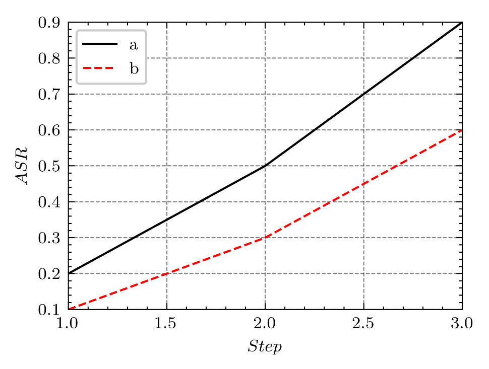

# PaperPlots

用于绘制各种各样的论文图片

## 配置环境

```
pip install -r requirment.txt
```

## 使用指南

- [x] 读取文件夹中的数据绘制折线图（tensorboard）

我们可以在Tensorboard中下载下来训练数据，将训练数据放到文件夹中
并重新命名好（不要有中文），修改脚本`script_draw_linw.py`中的配置后运行即可生成图像;




still updating.....

